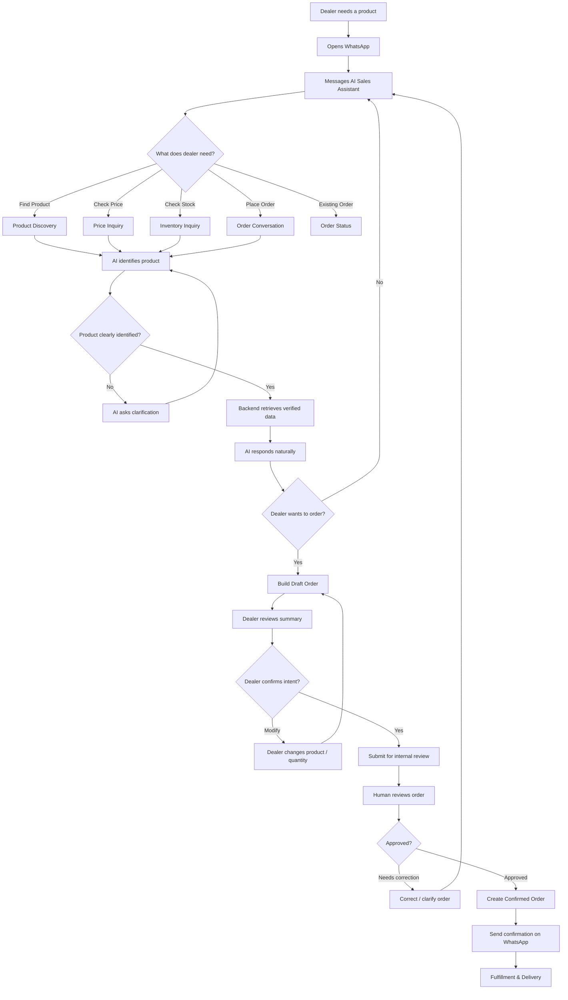
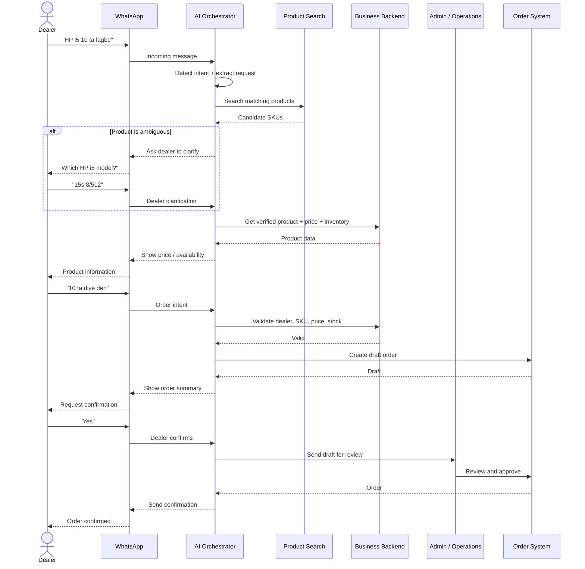
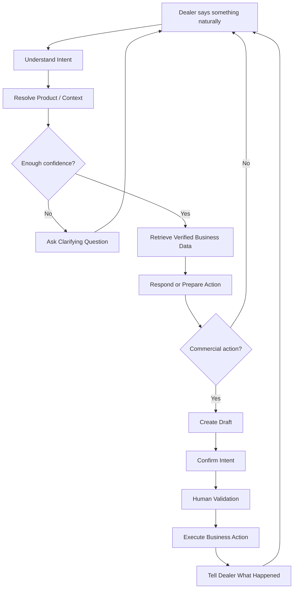
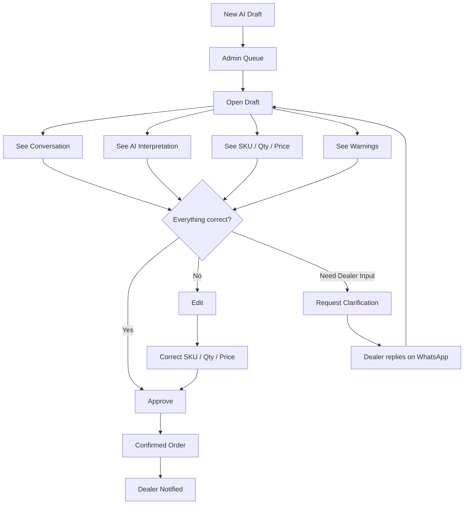

# Dealer User Journey — Conversational AI Distribution Platform

## 1. High-Level User Journey



---

# 2. Example Dealer Journey

The experience should feel like talking to a knowledgeable sales representative, not interacting with a traditional chatbot.

```text

DEALER

│

│ "Bhai HP i5 laptop ase?"

▼

┌──────────────────────────────┐

│ WHATSAPP AI │

│ │

│ Understands dealer intent: │

│ PRODUCT SEARCH │

└──────────────┬───────────────┘

│

▼

┌──────────────────────────────┐

│ PRODUCT MATCHING │

│ │

│ Search 600+ SKUs │

│ Find possible HP i5 models │

└──────────────┬───────────────┘

│

▼


AI:

"We have 3 HP i5 models available:


1. HP 15s — i5 / 8GB / 512GB

2. HP Pavilion — i5 / 16GB / 512GB

3. HP ProBook — i5 / 8GB / 512GB


Which one do you need?"


│

▼


DEALER:

"First ta. Price koto?"


│

▼

┌──────────────────────────────┐

│ AI CONTEXT │

│ │

│ "First ta" = HP 15s │

│ Intent = PRICE CHECK │

└──────────────┬───────────────┘

│

▼


BACKEND PRICE LOOKUP


│

▼


AI:

"Your price is ৳XX,XXX per unit.

We currently have 24 available."


│

▼


DEALER:

"10 ta diye den."


│

▼

┌──────────────────────────────┐

│ ORDER DRAFTING │

│ │

│ HP 15s │

│ Quantity: 10 │

│ Dealer-specific price │

│ Stock validated │

└──────────────┬───────────────┘

│

▼


AI:

"Order summary:


HP 15s i5 / 8GB / 512GB

Quantity: 10

Unit price: ৳XX,XXX

Total: ৳XXX,XXX


Should I submit this order?"


│

▼


DEALER:

"Actually 15 ta koren."


│

▼


UPDATE DRAFT ORDER


│

▼


AI:

"Updated to 15 units.


Total: ৳XXX,XXX


Submit?"


│

▼


DEALER:

"Yes."


│

▼

┌──────────────────────────────┐

│ HUMAN REVIEW │

│ │

│ Operations verifies: │

│ ✓ Dealer │

│ ✓ SKU │

│ ✓ Quantity │

│ ✓ Price │

│ ✓ Inventory │

└──────────────┬───────────────┘

│

▼


ORDER APPROVED


│

▼


AI:

"Your order has been confirmed.


Order: #ORD-10241

15 × HP 15s


We'll update you when it's ready for dispatch."

```

---

# 3. System Journey Behind the Conversation



---

# 4. Dealer Journey by Stage

| Stage | Dealer Thinks | Dealer Does | System Does | Desired Experience |

| ----------------- | ----------------------------------- | -------------------------------- | --------------------------------- | --------------------------------- |

| **Need** | "I need some products." | Opens WhatsApp | Nothing yet | No new app required |

| **Discovery** | "What's available?" | Asks naturally | Searches catalog | Feels like talking to salesperson |

| **Clarification** | "That's not exactly what I meant." | Gives more details | Resolves SKU ambiguity | AI asks rather than guesses |

| **Evaluation** | "What's my price? Is it available?" | Asks price/stock | Checks live backend | Fast and accurate |

| **Decision** | "I'll take 10." | Sends informal instruction | Builds structured draft | No forms required |

| **Modification** | "Actually make it 15." | Changes request conversationally | Updates same draft/context | Conversation feels continuous |

| **Review** | "Did it understand me correctly?" | Reviews summary | Shows exact SKU, qty, price | Clear before commitment |

| **Confirmation** | "Yes, place it." | Confirms | Sends for human approval | Dealer knows request was received |

| **Approval** | "Is my order confirmed?" | Waits briefly | Human verifies commercial details | High trust |

| **Fulfillment** | "Where is my order?" | Asks naturally | Retrieves order status | Same conversation continues |

---

# 5. The Core Product Loop



The fundamental loop is:

**Understand → Resolve → Verify → Act → Confirm**

The AI should never skip **Verify** before making a commercial commitment.

---

# 6. Critical Alternative Journeys

The PRD should not design only for the "happy path."

### Ambiguous Product

```text

Dealer:

"Samsung monitor 10 ta den."


AI:

"Which Samsung monitor do you mean?


1. 22-inch FHD

2. 24-inch IPS

3. 27-inch IPS"


Dealer:

"24 inch."


→ Continue order

```

### Insufficient Stock

```text

Dealer:

"20 ta den."


AI:

"We currently have 12 available.


Would you like:

• 12 units now

• Request all 20

• See similar products"

```

### Dealer Changes Their Mind

```text

Dealer:

"10 ta den."


AI:

[Creates draft]


Dealer:

"Na thak, cancel."


→ Draft cancelled

→ No commercial order created

```

### Multiple Products in One Message

```text

Dealer:

"HP 15s 10 ta,

Logitech mouse 20 ta,

ar Samsung 24 inch monitor 5 ta lagbe."


AI identifies three line items.


If one item is ambiguous:


→ Resolve only that item

→ Preserve the other two

→ Continue building the same order

```

### Voice Note

```text

Dealer sends:


🎤 "Bhai oi HP laptop ta jeita last week

nisi oita aro doshta lagbe."


System must understand:


"oi HP laptop"

+

"last week nisi"

↓

Dealer's order history

↓

Candidate previous SKU

↓

Confirm product if necessary

↓

Draft new order

```

---

# 7. Human Operations Journey

The internal team's journey is equally important.



The internal dashboard should optimize for one thing:

**How quickly can a human verify an AI-generated order with confidence?**

The human should not have to reread a 30-message WhatsApp conversation to understand what happened.

Ideally, they see:

```text

┌─────────────────────────────────────────────┐

│ ORDER REVIEW #D10241 │

│ │

│ Dealer: ABC Computers │

│ │

│ AI INTERPRETATION │

│ │

│ HP 15s i5 / 8GB / 512GB × 15 │

│ SKU: HP15S-I5-8512 │

│ Price: ৳XX,XXX │

│ Stock: 24 │

│ │

│ Dealer explicitly confirmed: YES │

│ │

│ ⚠ AI corrected quantity from 10 → 15 │

│ │

│ [View Conversation] │

│ │

│ [Reject] [Edit] [Approve] │

└─────────────────────────────────────────────┘

```

---

# 8. Product Experience Principle

The dealer should experience:

```text

"I am talking to my distributor."

```

Not:

```text

"I am operating an AI chatbot."

```

The complexity should exist behind the interface:

```text

SIMPLE

│

▼


Dealer ──────────► WhatsApp

│

══════════════════════╪══════════════════════

│

INVISIBLE COMPLEXITY

│

┌─────────────┼─────────────┐

▼ ▼ ▼

AI Catalog Context

│ │ │

├──────── Price Engine ─────┤

│ │ │

├──────── Inventory ────────┤

│ │ │

├──────── Orders ───────────┤

│ │ │

└────── Human Approval ─────┘

│

▼

Business Execution

```

**One conversational interface on the outside. Structured, deterministic business systems on the inside.**

The next useful artifact would be a **full journey map with three swimlanes — Dealer, AI/System, and Human Operations — covering discovery through fulfillment**, then use that to identify every screen, API, AI tool, state transition, and acceptance criterion required for the MVP.
